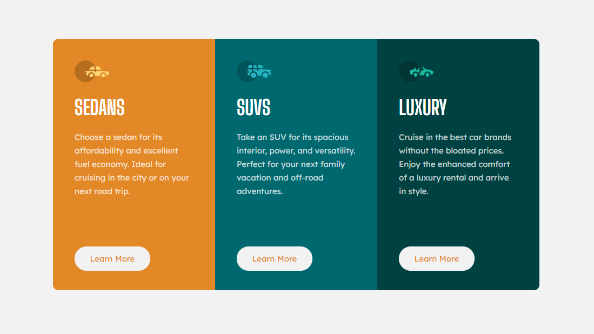

# Frontend Mentor - 3-column preview card component solution

This is a solution to the [3-column preview card component challenge on Frontend Mentor](https://www.frontendmentor.io/challenges/3column-preview-card-component-pH92eAR2-). Frontend Mentor challenges help you improve your coding skills by building realistic projects. 

## Overview

### The challenge

Users should be able to:

- View the optimal layout depending on their device's screen size
- See hover states for interactive elements

### Screenshot

### Links

- Solution URL: [Solução](https://www.frontendmentor.io/solutions/3column-preview-card-component-challenge-hub-WaMpS4Jwn)
- Live Site URL: [Site](https://cartao-de-visualizacao-de-3-colunas.netlify.app/)

## My process

### Built with

- Semantic HTML5 markup
- CSS custom properties
- Flexbox
- CSS Grid
- Mobile-first workflow

## Author

- Linkedin - [Jeferson Pimentel](https://www.linkedin.com/in/jefersonpimentel21/)
- Frontend Mentor - [@jefersonpimentel](https://www.frontendmentor.io/profile/FrontalAce21)
